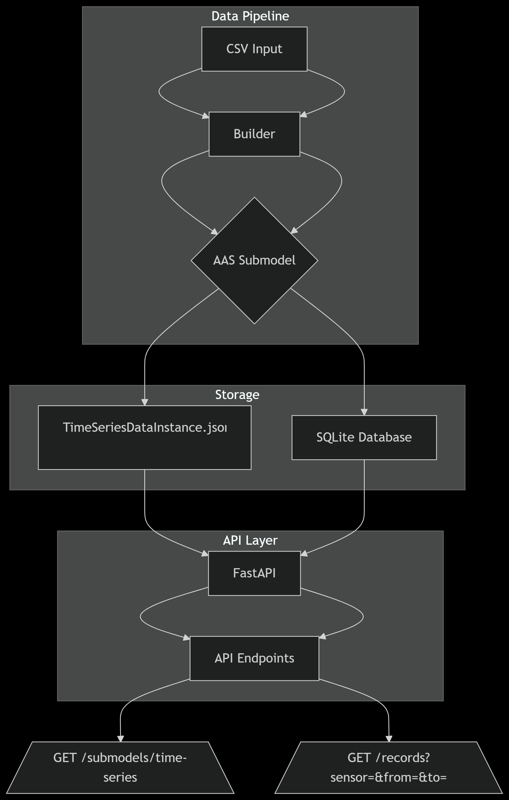

# BAM Digital Twin - Time Series Data Submodel



## Project Overview

Implementation of a standards-compliant Asset Administration Shell (AAS) submodel for time series sensor data, based on the IDTA 02008-1-1 template. The system processes CSV sensor data, generates AAS-compliant JSON, and provides REST API access.

## Features

- 🚀 CSV to AAS Submodel conversion
- ⚡ REST API for submodel access
- 🗃️ SQLite external storage
- 📊 Time series data statistics calculation
- ✅ IDTA 02008-1-1 standards compliant


## Builder Module (`Builder.py`)

The Builder is the core component that transforms raw sensor data into a standards-compliant AAS submodel.

### Key Responsibilities

   **CSV to AAS Conversion**:
   - Processes input CSV files with sensor measurements
   - Generates IDTA 02008-1-1 compliant JSON submodels
   - Maintains strict adherence to the official template

## API Documentation

### Starting the API Server

bash
uvicorn src.api_json_export:app --reload 


## Testing with Swagger UI

You can test the API interactively using Swagger UI:

### Access the Interactive Documentation

Open your browser and go to:
http://127.0.0.1:8000/docs#/default/get_submodel_api_v1_aas__asset_id__submodels_time_series_get


###  Locate the Endpoint

Find the following endpoint in the Swagger UI:


GET/api/v1/aas/{asset_id}/submodels/time-series


### ▶ Test the Endpoint

1. Click the **"Try it out"** button.
2. Enter an asset ID, for example: `sensor_1`
3. Click **"Execute"**
4. View the response in the **"Server response"** section.

###  Example Response
```json
{
  "asset_id": "sensor_1",
  "submodel": {
    "id": "urn:uuid:123...",
    "submodelElements": [
      {
        "idShort": "sensor_1",
        "value": [
          {
            "idShort": "Records",
            "value": [...]
          }
        ]
      }
    ]
  }
}
```
## Test Suite Documentation

### Test File: `tests/test_builder.py`

This test suite validates the core functionality of the Builder component, ensuring it correctly processes CSV data into AAS-compliant submodels.

#### Key Test Cases:

1. **CSV to JSON Conversion**  
   - Verifies the Builder creates a valid Submodel object  
   - Checks that submodel elements are generated  

2. **Segment Creation**  
   - Tests that one segment is created per sensor  
   - Validates correct sensor IDs are included  

3. **Record Limit Enforcement**  
   - Confirms only ≤500 records are kept inline  
   - Tests with 600-record input file  

4. **Statistics Calculation**  
   - Validates:  
     - Record count  
     - Start/end timestamps  
     - Sampling interval calculation  

5. **Schema Compliance**  
   - Ensures output matches IDTA 02008-1-1 standard  
   - Checks for required "submodelElements" field  

#### Test Data:
- Uses generated CSV files with:
  - Multiple sensors (temp, humi, light)
  - Timestamped values
  - Test cases with both small (4 records) and large (600 records) datasets

#### How to Run:
```bash
pytest tests/test_builder.py -v


# acces the api endpoints
0- python -m uvicorn src.api_json_export:app --reload
1- http://127.0.0.1:8000/api/v1/aas/sensor_1/submodels/time-series
2- http://127.0.0.1:8000/docs#/
